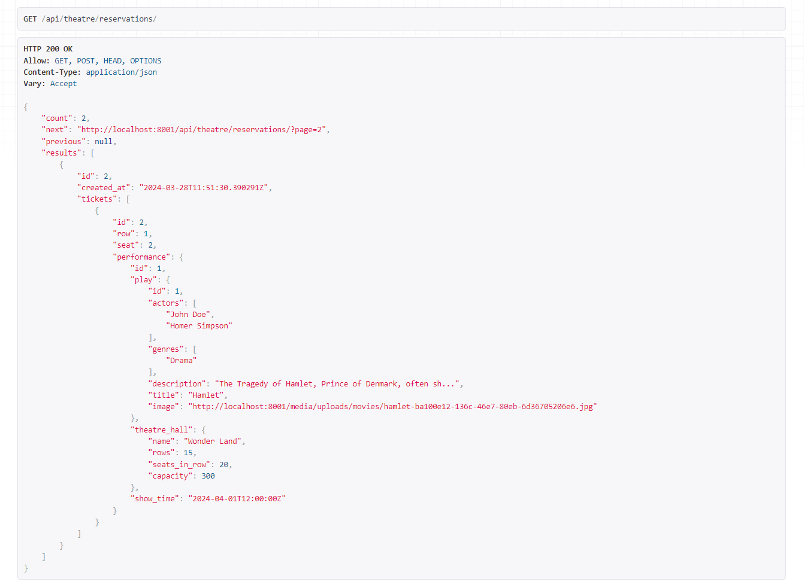
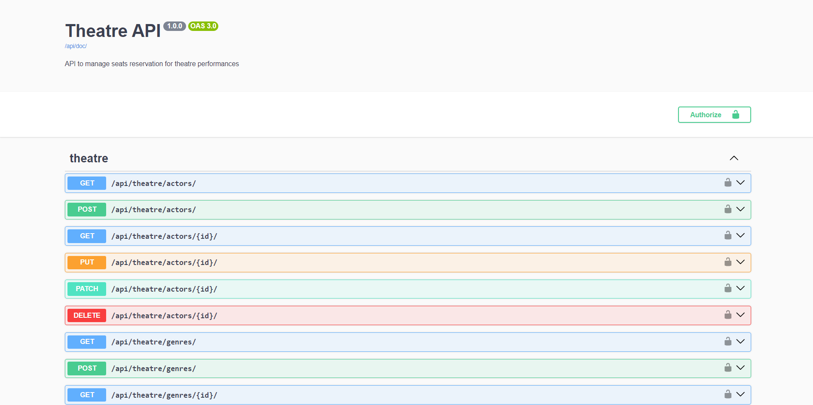
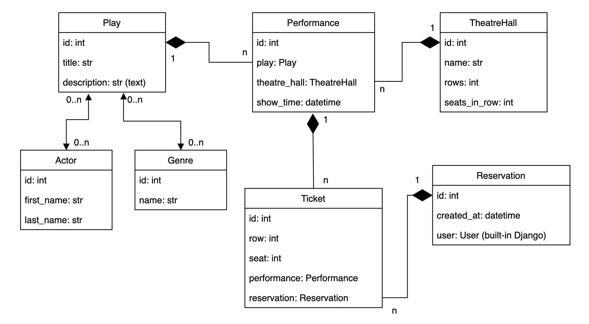

# Theatre API

API for a theatre service. The idea is to allow visitors of the Theatre to make Reservations online and choose needed seats, without going physically to the Theatre.

## Installing using GitHub
Install PostgreSQL and create DB (in case you don't use Docker). Create .env file and fill it out using .sample_env as an example.
```shell
git clone https://github.com/kabust/Theatre-API.git
cd Theatre-API
```

If you want to run it without Docker do the following:
```shell
python -m venv venv
pip install -r requirements.txt
python manage.py migrate
python manage.py runserver
```

## Run with Docker

```shell
docker-compose build
docker-compose up
```

### Creating SuperUser

```shell
# Locally:
python manage.py createsuperuser

# Using Docker:
docker ps # find your Django image and copy its ID
docker exec -it <id> sh
python manage.py createsuperuser
```

<i>If you don't want to create a new superuser you can use the following credentials</i>

<i>To log in as a regular user:</i>
* <i>Email: customer@test.com</i>
* <i>Password: Sandbox!1</i>

<i>To log in as a staff member:</i>
* <i>Email: admin@test.com</i>
* <i>Password: Sandbox!1</i>

## Getting access

* Create a new user via /api/user/register/ or use a previously created superuser
* Get access token via /api/user/token/ (it will be active for 10 minutes)

## Features

* JWT authentication
* Different permissions for unauthenticated, regular, and admin users
* Admin panel (/admin/)
* Browsable API
* Documentation (/api/doc/swagger/)
* Managing reservations and tickets
* Creating plays with actors and genres
* Plays filtering
* Pagination (Reservations and Performances)
* Throttling
* Media files handling (Plays with images)

## Demo



## Models schema

